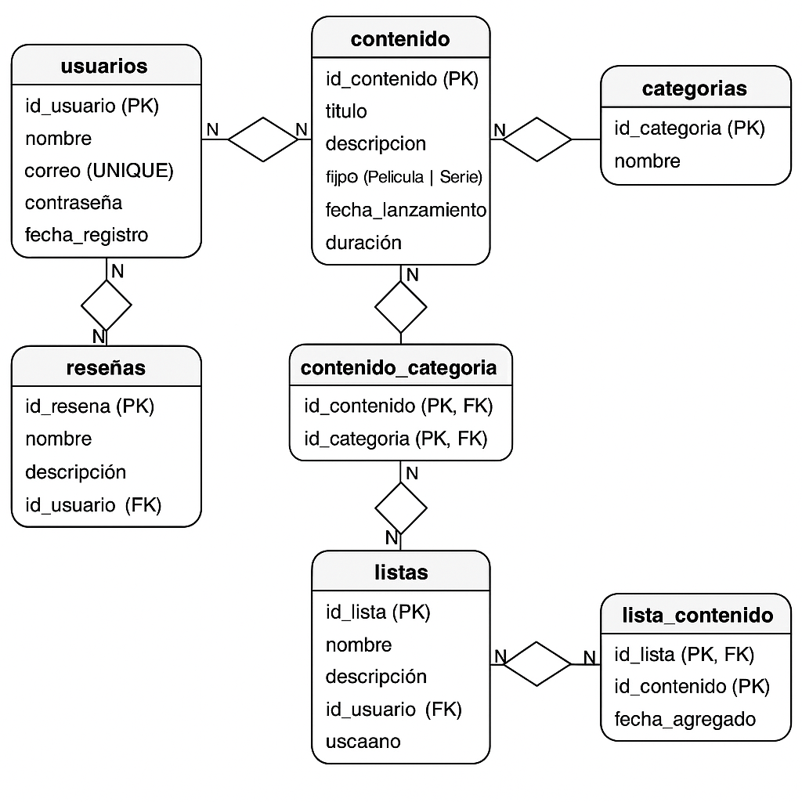

# Modelo Entidad–Relación de CineMatch

## 1. Modelo Entidad–Relación (ER)

### Entidades:

- **🔶 Tabla: usuarios**

id_usuario (PK)

nombre

correo (UNIQUE)

contraseña

fecha_registro

- **🔶 Tabla: contenido**
  
id_contenido (PK)

titulo

descripcion

tipo (Película | Serie)

fecha_lanzamiento

duracion

- **🔶 Tabla: categorias**
  
id_categoria (PK)

nombre

- **🔶 Tabla: contenido_categoria**
  
id_contenido (PK, FK → contenido.id_contenido)

id_categoria (PK, FK → categorias.id_categoria)

- **🔶 Tabla: reseñas**
  
id_resena (PK)

comentario

calificacion

fecha

id_usuario (FK → usuarios.id_usuario)

id_contenido (FK → contenido.id_contenido)

- **🔶 Tabla: listas**
  
id_lista (PK)

nombre

descripcion

id_usuario (FK → usuarios.id_usuario)

- **🔶 Tabla: lista_contenido**
  
id_lista (PK, FK → listas.id_lista)

id_contenido (PK, FK → contenido.id_contenido)

fecha_agregado

### Relaciones:

- Un **usuario** puede crear muchas **listas**.  
- Una **lista** pertenece a un solo **usuario**.

- Una **lista** puede contener muchos **contenidos**, y un **contenido** puede estar en muchas **listas** (relación N:M).

- Un **usuario** puede dejar muchas **reseñas**.  
- Una **reseña** pertenece a un solo **usuario**.

- Un **contenido** puede tener muchas **reseñas**, y cada **reseña** está asociada a un solo **contenido**.

- Un **contenido** puede pertenecer a muchas **categorías**, y una **categoría** puede contener muchos **contenidos** (relación N:M).

---

## 2. Diagrama Relacional

