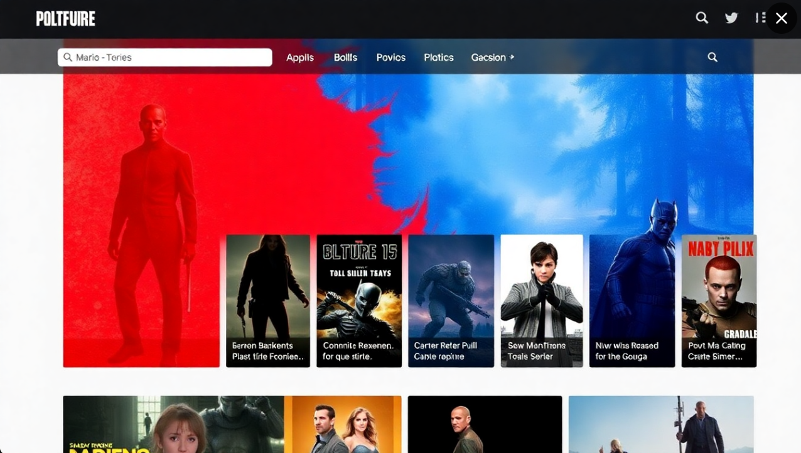
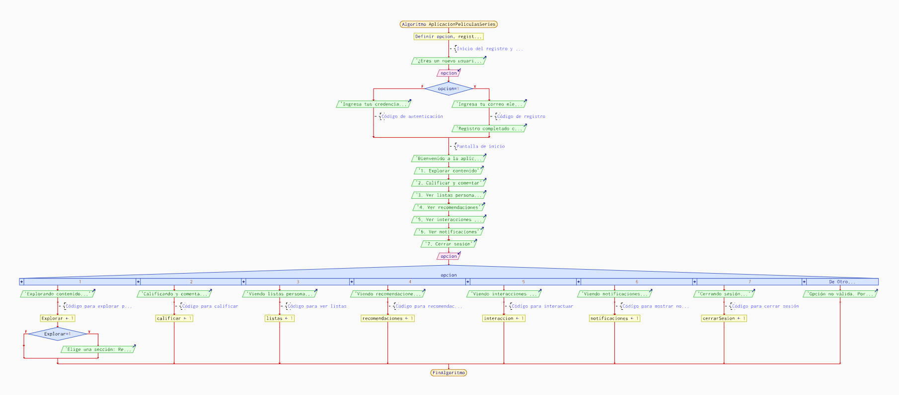

# CineMatch

________________________________________

## A. Nombre de tu App:
**CineMatch**

________________________________________

## B. Descripción de tu App (¿Qué vas a hacer?):
CineMatch es una plataforma en línea diseñada para recomendar películas y series según los gustos de cada usuario. La aplicación permite a los usuarios explorar una amplia variedad de títulos, calificarlos, dejar comentarios y crear listas personalizadas. Además, cuenta con un sistema de autenticación (por ejemplo, con Google o Facebook) y un algoritmo que sugiere contenido basado en las preferencias y valoraciones individuales. El objetivo es ofrecer una experiencia personalizada, intuitiva y visualmente atractiva similar al estilo de plataformas populares como Netflix, pero con un enfoque en la comunidad y en la recomendación colaborativa.

________________________________________

________________________________________

## C. Algoritmo de Funcionamiento de CineMatch

### 1. Registro y Autenticación:
- El usuario accede a la aplicación y tiene la opción de registrarse o iniciar sesión mediante su cuenta de Google o Facebook.
- Si es un nuevo usuario, se le pide que ingrese información básica (nombre, correo electrónico, etc.) y complete el registro.
- Si el usuario ya tiene una cuenta, simplemente inicia sesión con sus credenciales.

### 2. Pantalla de Inicio:
- Una vez que el usuario se ha autenticado, se le presenta la pantalla principal con un diseño limpio, similar a un catálogo de películas y series.
- El usuario puede ver una lista de títulos recomendados, basados en sus gustos previos, listas populares o por género (acción, comedia, drama, etc.).

### 3. Explorar Contenido:
- El usuario puede navegar a través de diferentes secciones como “Recomendados para ti”, “Películas populares”, “Series recomendadas” o "Novedades".
- Cada título (película o serie) está acompañado de una breve descripción, una puntuación promedio (calificación) dada por otros usuarios, y una carátula atractiva.
- Además, el usuario puede buscar títulos específicos utilizando una barra de búsqueda.

### 4. Calificación y Comentarios:
- Cuando el usuario selecciona una película o serie, se le presenta una página de detalles con más información sobre el título, como sinopsis, duración, reparto, etc.
- El usuario puede calificar la película o serie en una escala del 1 al 5 estrellas y dejar un comentario si lo desea.
- Las calificaciones y comentarios se almacenan en la base de datos y se utilizan para generar recomendaciones personalizadas para otros usuarios.

### 5. Listas Personalizadas:
- El usuario tiene la opción de crear listas personalizadas, por ejemplo, "Favoritas", "Por ver", "Recomendadas por amigos", etc.
- Puede agregar películas o series a sus listas y, a su vez, compartirlas con amigos o con la comunidad dentro de la aplicación.

### 6. Recomendaciones Personalizadas:
- Cada vez que el usuario califique una película o serie, el sistema ajusta sus recomendaciones basándose en sus valoraciones previas y en el contenido que ha mostrado más interés (por ejemplo, género, actores, etc.).
- El algoritmo de recomendación también puede usar técnicas de filtrado colaborativo, lo que significa que las recomendaciones se basan no solo en las preferencias del usuario, sino también en las de usuarios con gustos similares.

### 7. Interacción Social:
- Los usuarios pueden seguir a otros usuarios dentro de la app para ver sus listas de recomendaciones y sus calificaciones.
- También pueden interactuar dejando comentarios o “me gusta” en las valoraciones de otros usuarios.

### 8. Notificaciones:
- El usuario recibirá notificaciones sobre nuevas recomendaciones, comentarios en sus publicaciones, actualizaciones sobre títulos que sigue y recordatorios para ver las películas o series que ha añadido a su lista “Por ver”.

### 9. Feedback y Mejora de Recomendaciones:
- El sistema aprende continuamente de las interacciones del usuario (por ejemplo, calificaciones, búsquedas) para mejorar las recomendaciones con el tiempo.
- Si el usuario cambia sus preferencias o interactúa con contenido diferente, el algoritmo se ajusta para ofrecer sugerencias más precisas.

### 10. Cierre de Sesión:
- Finalmente, cuando el usuario desee salir de la aplicación, puede hacerlo a través del menú de configuración, donde también tiene la opción de actualizar su perfil, cambiar sus credenciales o cerrar sesión de manera segura.

________________________________________

## D. Aplicación Dinámica:

### 1. Parte Pública:
La parte pública de la aplicación estará disponible para cualquier usuario que la navegue sin necesidad de autenticación. En esta sección se podrán ver recomendaciones generales de películas y series basadas en popularidad, género y las valoraciones más altas. Los usuarios podrán explorar títulos, leer reseñas generales, y ver trailers sin necesidad de iniciar sesión.

### 2. Parte Privada:
Los usuarios autenticados podrán acceder a su propia cuenta, donde podrán ver sus recomendaciones personalizadas, calificar películas y series, gestionar sus listas de contenido favorito, y ver su historial de valoraciones. Solo aquellos usuarios que hayan iniciado sesión correctamente podrán interactuar con estas funcionalidades privadas.

________________________________________

## E. Sistema de Autenticación:

### 1. Registro de Usuarios:
Los nuevos usuarios podrán registrarse a través de un formulario de registro en el que deberán proporcionar su correo electrónico, nombre de usuario y una contraseña segura. El sistema enviará un correo de verificación para confirmar la identidad del usuario.

### 2. Inicio de Sesión con Autenticación Segura:
Los usuarios podrán iniciar sesión utilizando su correo electrónico o nombre de usuario y la contraseña asociada. Se implementará un sistema de autenticación segura con técnicas como hashing de contraseñas (por ejemplo, bcrypt) y sesiones protegidas para garantizar la seguridad del usuario.

### 3. Recuperación de Contraseña:
En caso de que el usuario olvide su contraseña, se podrá recuperar a través de un enlace enviado al correo electrónico registrado. El enlace permitirá cambiar la contraseña por una nueva de manera segura.

________________________________________

## F. Base de Datos:

### 1. Almacenamiento de Información:
Los usuarios autenticados podrán almacenar información personalizada dentro de la aplicación, como las películas y series que han calificado, sus listas de favoritos y sus recomendaciones preferidas.

### 2. Subida de Archivos:
Los usuarios podrán subir ficheros relacionados con sus interacciones en la plataforma, como capturas de pantalla, carteles de películas o series recomendadas, o cualquier otro tipo de contenido multimedia relacionado.

### 3. Visualización de Información y Archivos:
Todos los usuarios podrán ver el contenido y los archivos subidos por los usuarios autenticados en la parte pública de la plataforma, como recomendaciones destacadas, reseñas o trailers. Este contenido podrá ser visualizado sin necesidad de iniciar sesión.

________________________________________

## G. Diseño, Interfaz y Experiencia de Usuario:

### 1. Diseño Visual Atractivo y Coherente:
El diseño de la interfaz será moderno, visualmente atractivo y coherente con la temática de entretenimiento (películas y series). Se utilizarán colores llamativos, tipografía legible y un layout claro que facilite la navegación.

### 2. Diseño Responsivo:
La aplicación estará optimizada para ser visualizada y utilizada en dispositivos móviles, tabletas y computadoras de escritorio, garantizando que la experiencia de usuario sea fluida y consistente en todas las plataformas.

### 3. Navegación Intuitiva y Fácil de Usar:
La interfaz será sencilla de navegar, con un menú claro que permita a los usuarios acceder rápidamente a las secciones de recomendaciones, calificaciones, listas personalizadas, perfil de usuario, y más. Los botones estarán bien distribuidos y las acciones serán fácilmente comprensibles.

________________________________________

## H. Seguridad:

**Buenas Prácticas de Código y Seguridad:**
- Se implementarán medidas de seguridad como la encriptación de contraseñas utilizando hashing seguro (por ejemplo, bcrypt).
- La protección contra ataques de inyección SQL será garantizada utilizando consultas preparadas.
- Validación de entradas y medidas contra vulnerabilidades XSS y CSRF.
- Uso de sesiones seguras con cookies HttpOnly y Secure.
- Autenticación multifactor (2FA) opcional para mayor seguridad.

________________________________________

________________________________________