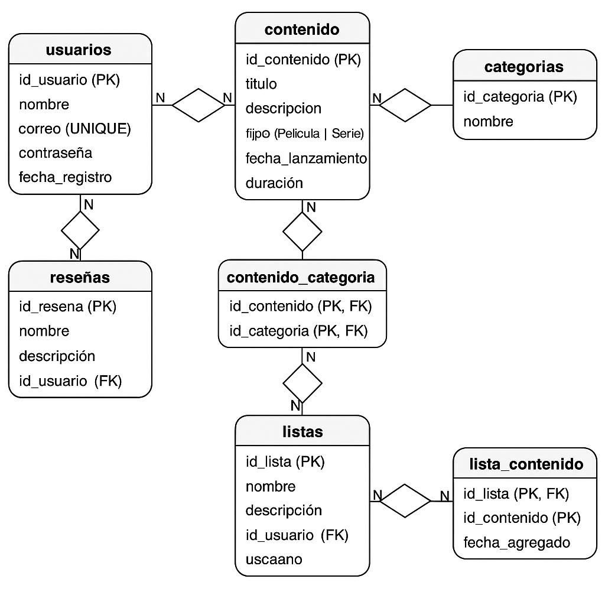

# Modelo Entidad–Relación de CineMatch

## 1. Modelo Entidad–Relación (ER)

### Entidades:

- **🔶 Tabla: usuarios**

id_usuario (PK)

nombre

correo (UNIQUE)

contraseña

fecha_registro

- **🔶 Tabla: contenido**
  
id_contenido (PK)

titulo

descripcion

tipo (Película | Serie)

fecha_lanzamiento

duracion

- **🔶 Tabla: categorias**
  
id_categoria (PK)

nombre

- **🔶 Tabla: contenido_categoria**
  
id_contenido (PK, FK → contenido.id_contenido)

id_categoria (PK, FK → categorias.id_categoria)

- **🔶 Tabla: reseñas**
  
id_resena (PK)

comentario

calificacion

fecha

id_usuario (FK → usuarios.id_usuario)

id_contenido (FK → contenido.id_contenido)

- **🔶 Tabla: listas**
  
id_lista (PK)

nombre

descripcion

id_usuario (FK → usuarios.id_usuario)

- **🔶 Tabla: lista_contenido**
  
id_lista (PK, FK → listas.id_lista)

id_contenido (PK, FK → contenido.id_contenido)

fecha_agregado

### Relaciones:

- Un **usuario** puede crear muchas **listas**.  
- Una **lista** pertenece a un solo **usuario**.

- Una **lista** puede contener muchos **contenidos**, y un **contenido** puede estar en muchas **listas** (relación N:M).

- Un **usuario** puede dejar muchas **reseñas**.  
- Una **reseña** pertenece a un solo **usuario**.

- Un **contenido** puede tener muchas **reseñas**, y cada **reseña** está asociada a un solo **contenido**.

- Un **contenido** puede pertenecer a muchas **categorías**, y una **categoría** puede contener muchos **contenidos** (relación N:M).

---

## 2. Diagrama Relacional

## 3. Reglas del Negocio

### 1. Gestión de Usuarios
- Cada usuario debe tener un nombre, correo único y contraseña para autenticarse en la plataforma.
- Un usuario solo puede registrarse una vez con un correo específico.
- La fecha de registro se guarda automáticamente al momento del alta.

### 2. Contenido Multimedia
- El contenido puede ser clasificado como **Película** o **Serie**.
- Cada contenido debe contar con:
  - Título
  - Descripción
  - Duración (en minutos)
  - Fecha de lanzamiento
- El contenido puede estar relacionado con una o más categorías.

### 3. Categorías
- Las categorías permiten agrupar contenidos por género o tema (e.g., Acción, Comedia).
- Cada contenido puede pertenecer a varias categorías.
- Cada categoría puede contener múltiples contenidos.

### 4. Relación Contenido-Categoría
- No se permiten relaciones duplicadas entre un contenido y una categoría.
- Solo se pueden crear relaciones si ambos elementos existen.

### 5. Reseñas
- Solo los usuarios registrados pueden dejar reseñas.
- Cada reseña debe incluir:
  - Comentario
  - Calificación (entero)
  - Fecha de publicación
- Un usuario puede dejar varias reseñas, aunque solo una por contenido es lo más recomendable.

### 6. Listas de Usuario
- Cada usuario puede crear múltiples listas personalizadas (por ejemplo, "Favoritos", "Ver después").
- Una lista puede contener varios contenidos, y un contenido puede estar en múltiples listas.
- Se debe registrar la fecha en la que el contenido fue agregado a la lista.

### 7. Integridad de Datos
- No se debe permitir eliminar un contenido, usuario o categoría si tiene relaciones con otras entidades.
- La integridad referencial debe ser mantenida (con claves foráneas o lógica de la aplicación).

