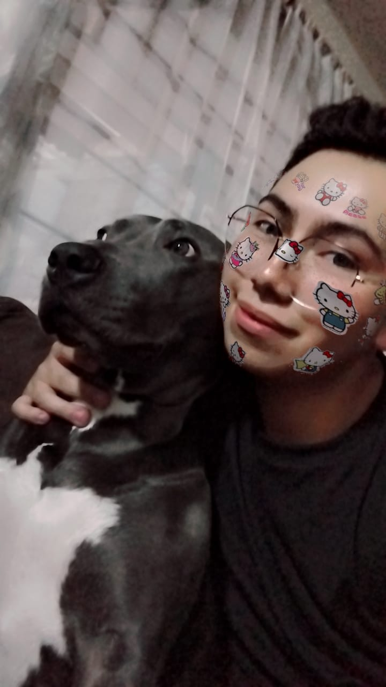

## a. Datos personales
- **Nombre:** Bryan Sebastian Ruiz  
- **Edad:** 20 años
- **Fotografía:**

---

## b. Presentación personal
Me llamo Brian Sebastian Ruiz y me agrada jugar además de ver lo que es anime y también pasar tiempo con mi familia aparte de hacer que hacer en mi casa y pasar tiempo con mi mascota y tambien me agrada muchisimo aprender cosas nuevas aunque me aburro cuando salen bien.

---

## c. ¿Por qué elegiste tu carrera y en qué esperas trabajar?
Elegí esta carrera en un principio porque me agradaba lo que era la parte de hackear pero después vi que como tal no es solamente hackear y es un mundo más de cosas ya sea como redes forense o cosas diferentes y espero poder trabajar en lo que es la empresa de Microsoft, Facebook o Google.

---

## d. Pasatiempos
Mis pasatiempos son jugar videojuegos ya sea en la computadora o en el celular además de ver vídeos cómo en YouTube y vídeos cortos en TikTok y también ver anime.

---

## e. Enlaces de contacto
- **Redes sociales:** Facebook: Bryan Sebastian Ruiz    Instagram: @kesobadon21
- **Correo electrónico:** nayrbes@gmail.com
